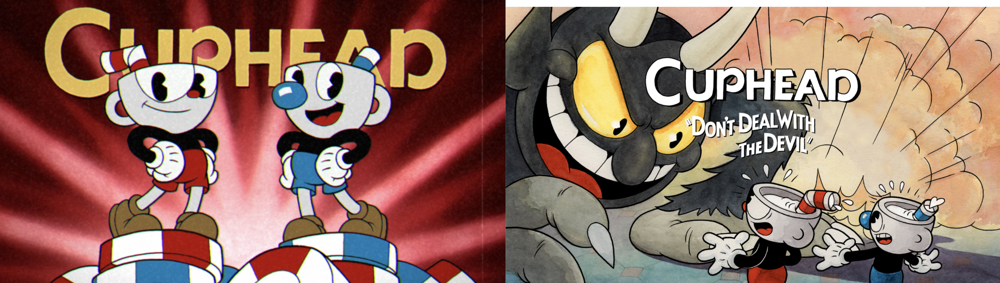
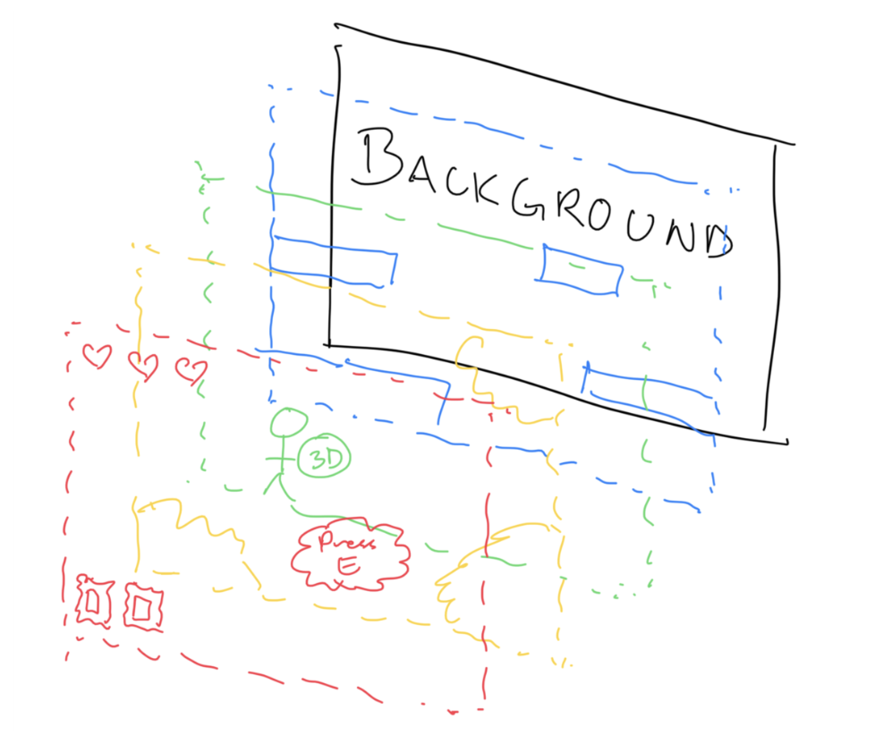

# Game Design Document (GDD)

## Table of contents

- [Game Overview](#gameoverview)
- [Story and Narrative](#story-and-narrative)
- [Gameplay and Mechanics](#gameplay-and-mechanics)
- [Levels and World Design](#levels-and-world-design)
- [Art and Audio](#art-and-audio)
- [User Interface](#user-interface)
- [Technology and Tools](#technology-and-tools)
- [Team communications, timelines and task management](#team-communications-timelines-and-task-management)
- [Possible Challenges](#possible-challenges)

## Game Overview
_Jack's Great Escape_ is based on a retelling of the well-known children’s fable, Jack and the Beanstalk. It is set in the kitchen of the Giant, and Jack is trying to escape whilst stealing some valuable possessions. The player is Jack, who is stuck in a ginormous kitchen tabletop, having to get past the sink, the stovetop and the cutting board, whilst picking up treasures including a bag of gold, a gold-laying hen, and a magic harp. The objective of the game is to dodge all obstacles and pick up the items to make it to the end, so that Jack can head back down to safety.

### Genre
The primary genre which this game falls under is Action, it is a running game which employs elements from classic platformers such as Super Mario Bros, such as dodging obstacles and timing jumps. This is demonstrated in when the player, Jack, must dodge dangers on the stovetop, sink, and chopping knives. 

Sub-genres of this game include the Adventure genre, as the multi-staged design of this game follows a clear storyline with narrative, and goal of collecting valuables and preserving safety. It also falls under the Collectathon genre as it involves collecting specific valuables to succeed in the game. As the overall storyline of the game is inspired by a common children’s story, the game also is part of the Fairy Tale genre.  

###  Target Audience
This game is targeted for children and teenagers, as it follows the story from a classic fable. It should be familiar to children and teenagers, bringing about a sense of wonder as they get see a childhood story brought to life, and perhaps nostalgia for teenagers about the story.

### Unique Selling Point
However, unique to mainstream platform games, this game plays with the perspective as you experience a kitchen setting from a tiny person’s perspective. It is also rare that modern games follow a classic fable storyline, as this game does, providing familiarity and keeping players invested as they already know the backstory of the characters. The art style chosen to render this game in, discussed in detail in the following paragraphs, is also unique and aims to instil a sense of nostalgia for the vintage 1930’s rubber hose animations, reminiscent of iconic characters like Oswald the Lucky Rabbit, Mickey Mouse, Betty Boop, and Popeye, taken from the early era of animation. 

## Story and Narrative
The game is based on a retelling of the well-known children’s fable, Jack and the Beanstalk.  

### Backstory
The main player is Jack, who sold his cow for magic beans that grew into a towering beanstalk. Climbing it, the Jack finds himself in a giant’s house in the clouds, unsure of who lives there but driven by a desire to steal the giant’s valuable possessions from the kitchen tabletop due to his own unsatisfactory financial situation. Jack is tiny compared to everything in the kitchen, navigating oversized knives, objects in the sink, and stovetops.

The backstory of how Jack came to be there is not shown in the game, as it is taken from a classic fable so is assumed knowledge, and it is also not necessary knowledge to play the game in the case the player has not heard of the story of Jack and the Beanstalk. 

### Narrative
The player begins the game in the giant’s kitchen, on the tabletop, ready to navigate their way through the obstacles to the treasures, and finally back to the safety of the beanstalk.  

At first, the giant is unaware of Jack’s presence, but as Jack collects treasured items like a bag of gold, a gold-laying hen, and a magic harp, the giant becomes increasingly angry and starts trying to eliminate Jack by turning on the faucet to drown Jack and swinging knives. The objective is for the Jack to dodge all hazards, gather the valuable items, and make it across the kitchen bench to reach the beanstalk, where Jack can escape back down to safety. 

### Jack
Jack is the main character of the game. He is poor and needs money to care for himself and his mother, and his worn clothes reflect his humble life. Jack is also reckless and cheeky, showing no hesitation in stealing from the giant to get what he wants.

_Jack Idle_

  

_Jack Movement_

  

## Gameplay and Mechanics

### Player Perspective
In the game, you are viewing from a third person perspective. That is to say that Jack will be on screen and you will viewing and controlling him from side on. The camera moves with Jack so the view will always be centred on Jack and he is visible in the frame. 

_Player Perspective_

  

Jack can interact with objects in the game world – they can hit him.

### Controls
Jack can interact with objects in the game world – they can hit him, he
will collide with them, he can jump on top of objects and can collect
treasures.

| **Key Input** | **Action**                                 |
|---------------|--------------------------------------------|
| W             | Jump up                                    |
| A             | Move left (backward in Jack’s perspective) |
| D             | Move right (forward in Jack’s perspective) |
| S             | Move down (when Jack is swimming)          |

### Progression
The goal of the game is that the player will progress through 3 levels
collecting treasure and not dying. The player will want to get past all
three level to collect the treasures and escape the kitchen.

<table>
<colgroup>
<col style="width: 31%" />
<col style="width: 33%" />
<col style="width: 35%" />
</colgroup>
<thead>
<tr>
<th>
<strong>Level 1:</strong>

<u>Antique Oven</u>

Easiest level. Jack simply has to
manoeuvre through without being burnt.
</th>
<th>
<strong>Level 2:</strong>

<u>Kitchen Sink</u>

Difficulty increases. 
</th>
<th>
<strong>Level 3:</strong>

<u>Chopping Board</u>

Difficulty increases again. 
</th>
</tr>
</thead>
<tbody>
<tr>
<td>Jack loses a life by being burned (running into/getting blasted by
the fire).</td>
<td>
Jack dies by drowning (runs out of bubbles). This will happen if he gets trapped by the dishes.
</td>
<td>Jack loses a life by being chopped (hit with a knife).</td>
</tr>
<tr>
<td>Jack has 3 lives.</td>
<td>Jack has 5 bubbles that he begins to lose when he is under the water
level.</td>
<td>Jack has 3 lives (this is separate to the previous level’s
life).</td>
</tr>
<tr>
<td>Jack wins level 2 by not dying and collecting gold-laying hen.</td>
<td>Jack wins level 1 by not dying and collecting bag of gold.</td>
<td>Jack wins the game by not dying and collecting golden harp.</td>
</tr>
</tbody>
</table>

See the next section for further info on how each level works.

### Mechanics
#### Player Actions

The player can run and jump, allowing them to navigate across platforms and dodge incoming threats (swim in level 2). 

The primary goal is to stay alive/avoid objects in order to successfully collect treasures. 

#### Core Mechanics and Rules 

For Level 1 & Level 3: The player begins with three hearts, representing their health. Each time the player collides with an obstacle/is chopped/is burnt, they lose a heart. When all three hearts are lost, the player “dies” and must restart the level from the beginning. 

  
  

For Level 2: The player begins with 5 bubbles that Jack loses when he spends time under water or collides with dishes. He dies when he runs out of bubbles. 

  
  

Progress is therefore tied to skilful movement and timing, encouraging players to refine their approach after each attempt. 

#### Theme Integration 

The core mechanic of avoiding obstacles to reach objectives reflects the game’s overarching theme: a miniature figure navigating a vast and challenging world. 

The hearts system reinforces the sense of fragility and perseverance, emphasizing the struggle of surviving in an environment much larger and more dangerous than the character. 

The loop of trial and error makes the game fun and rewarding, aligning the gameplay with the theme of determination against a large world. Here's a still of the game showing the miniature theme:

## Levels and World Design

### Game World
We will have a 2D setting with sideview parallax scrolling for our game. The camera follows our character leaving him near the middle of the screen whilst he traverses the kitchen environment. There will be 3 levels and for all levels the primary movement will be left and right movement with the addition of going up by jumping/swimming. There will be no mini map or map as each obstacle will be displayed on the screen.  

### Objects
The main objects of the game world will be the kitchen countertop (oven, sink + chopping board). This will be the platform that Jack traverses on.  

On the countertop will be several obstacles all of which are kitchen appliances or items. These items will either prevent the player from continuing onwards by blocking the path or damage the player. These include: knives, faucets, fire, logs and dishes. These objects are supposedly controlled by the Giant but in the game, you do not see him physically move/interact with the objects. They move like magic (fitting with our fable theme).  

### Physics
The physics of the game will include gravity, object collision, instantaneous left right movement and, variable jump height (dependent on keypress duration). The objects will move based off the player or the giant interacting with it. Each object will interact independently of each other objects as they do not move on their own.  

### Levels

#### Level 1
Jack tries to cross the oven whilst avoiding the flames that are bursting from the logs. He must hop on the logs that are no longer burning either due to being completely burnt or has not begun burning yet. Getting hit by the fire will reduce his heart by 1. He has 3 hearts, and will respawn to the beginning of the level when all hearts are lost. The fire turns on and off periodically. The level is completed by Jack finding and colliding with the bag of gold. 

_Level 1_

  

#### Level 2
Jack jumps in the sink and the giant turns on the faucet beginning the level. Jack now must avoid the falling dishes and kitchenware the giant is placing and use them to escape the sink. Jack will jump/swim (depending on where the water level is) from the kitchenware placed to reach a higher elevation to eventually escape the sink. As Jack is underwater, the bubbles will begin to be lost, and he has to make sure not to stay underwater too long or get stuck under a dish as then he will die (all bubbles burst). This will cause him to respawn to the start of the level. The level is completed by Jack finding and colliding with the magic harp.

_Level 2_

  

#### Level 3
Jack tries to cross the chopping board whilst the giant and his knives try to stop jack by chopping him up. The knives all move at different frequencies (knifes later in the level move faster). Getting hit by a knive reduces his hearts by 1. He has 3 hearts and will respawn at the start when all are lost. The level is completed by Jack finding and colliding with the gold-laying hen.

_Level 3_

  

## Art and Audio
Art Style: 1930s rubber hose animation. Simple rounded forms, flexible limbs that move like “rubber hoses”. Fluid, bouncy movement for characters. A game with a similar art style is Cuphead.  

  

### Character Design

- <u>Jack</u>: pie-cut eyes, simple oval head, stick-thin limbs that can
  stretch when jumping between giant utensils

  

### Environment Art style

- Everything should feel oversized and imposing from Jack's tiny
  perspective

- Kitchen surfaces could have that classic 1930s cartoon texture -
  simple, high-contrast shading

- Steam from pots, water droplets, and fire effects should move with
  that fluid, elastic quality

Sound and Music: To complement the 1930s style, we plan on using jazzy
upbeat music for the backing track, with each area having a different
composition to reflect the area’s mood. For example, sneaky ragtime
piano for stealth sections, triumphant swing when collecting treasures. We can match some of the
parkour elements to the music, making platforms appear and disappear in
sync. Environmental sounds would also
be in a jazzy style, with bubbling pots as percussion, knife chopping as
rhythmic elements.

### User Interface

_Design Breakdown_
This shows the breakdown, the final image on screen and the layers used.

  
  
  

### Health System
- Instead of generic hearts, we use rubberhose-style hearts that deflate when lost. Bubbles will pop in that rubberhose style.
See above in Game mechanics for style of hearts + bubbles.

### Treasure Collection
- Show the collected items (gold bag, hen, harp) in ornate 1930s-style frames at screen corners 

_Frames_

  
  
  

### Interactive UI elements
- Level transition screens designed like old cartoon title cards + pause scene.

- Movement indicators can be shown with subtle arrow overlays when approaching climbable objects.

  

## Technology and Tools
The game mechanics will be made in Unity. Version control and code management will be done through GitHub. The 2D objects will be drawn in Procreate or Photoshop as our team members have experience with these drawing softwares. The audio editing will be done in audacity as our team member have experience in it, and it fits our simple audio editing requirements. The versions of each software will be included once we begin.  

## Team communications, timelines and task management 
Deadlines:

| Milestone 1 | Team Declaration         | 1/9   |
|-------------|--------------------------|-------|
| Milestone 2 | Game Design Document     | 15/9  |
| Milestone 3 | Team Member Evaluation 1 | 25/9  |
| Milestone 4 | Evaluation Demo          | 13/10 |
| Milestone 5 | Gameplay Video           | 20/10 |
| Milestone 6 | Final Submission         | 5/11  |
| Milestone 7 | Team Member Evaluation 2 | 7/11  |
| Milestone 8 | Team Feedback Reflection | 9/11  |

\*All submissions due at 5pm

### Communication Plan
- Meetings twice a week: 

- Monday 1pm (in person, working meeting) 

- Friday 7pm (online stand-up, subject to time change) 

- All communication outside of meetings must occur on discord in the “Team Pixelate” discord server, there are seperate channels for 'art-character', 'code', 'art-background', 'art-objects', 'resources', 'push-and-pull', 'general', and a voice channel for online meetings.

- A document listing the breakdown of work and its progress will be updated to ensure the team stay on track. It will include meeting minutes. 

### Work Distribution
- Work should be distributed in a fair manner, considering the strengths and interests of all team members.  

- All work assigned will be documented in the progress tracker doc.

## Possible Challenges

Discuss potential difficulties you foresee during the development of your game, and how your team plans to address these issues as they arise. These could be technical challenges, time constraints, or anything else that might impact your team's ability to complete the project. Prototyping and testing can be particularly helpful here, and you should trial these out in the next milestone. 

### Technical Challenges 

<b>Merge conflicts:</b> We will establish clear Git workflows using feature branches, frequent commits, and regular pull requests. Hold short standup meetings (on Fridays) so everyone knows what others are working on. Vincent will be assigned a “merge master” if conflicts need to be reviewed and resolved. 

<b>Rendering:</b> Begin testing rendering early with prototypes, use Unity’s built-in profiling tools. 

<b>Bugs in the game:</b> Adopt a “test early, test often” approach with frequent playtesting. Assign bug-fixing sessions before each milestone. 

<b>Integrating the art style into Unity:</b> We will create early prototypes that integrate test art into Unity to identify issues. Document consistent pipelines for importing/exporting art assets. 

<b>Physics Tuning:</b> Calibrating Unity's physics system to feel appropriately "cartoon-like" rather than realistic - objects should bounce more, characters should have exaggerated gravity effects. 

### Audio Challenges: 

- Programming platforms and obstacles to move precisely with jazz beats requires complex audio-visual timing systems that could break if frame rates drop. 

- Shifting between different jazz styles (sneaky ragtime to frantic big band) based on gameplay states without jarring audio cuts.  

### Time Constraints 

- Team members not making their deadlines 

- Things taking longer than expected 

- Hand-drawing rubberhose animations is time-intensive. If the art team falls behind, programming and level design teams may be blocked. 

- Balancing time between fixing existing issues and implementing remaining features as deadlines approach. 

- Team members learning new aspects of Unity and its big learning curve, especially complex animation systems and audio integration, could slow initial progress. 

<b>Solution:</b> Hold regular short meetings (online or in person) to keep everyone aligned. Keep clear written documentation of design decisions. Encourage open communication when problems arise. 
